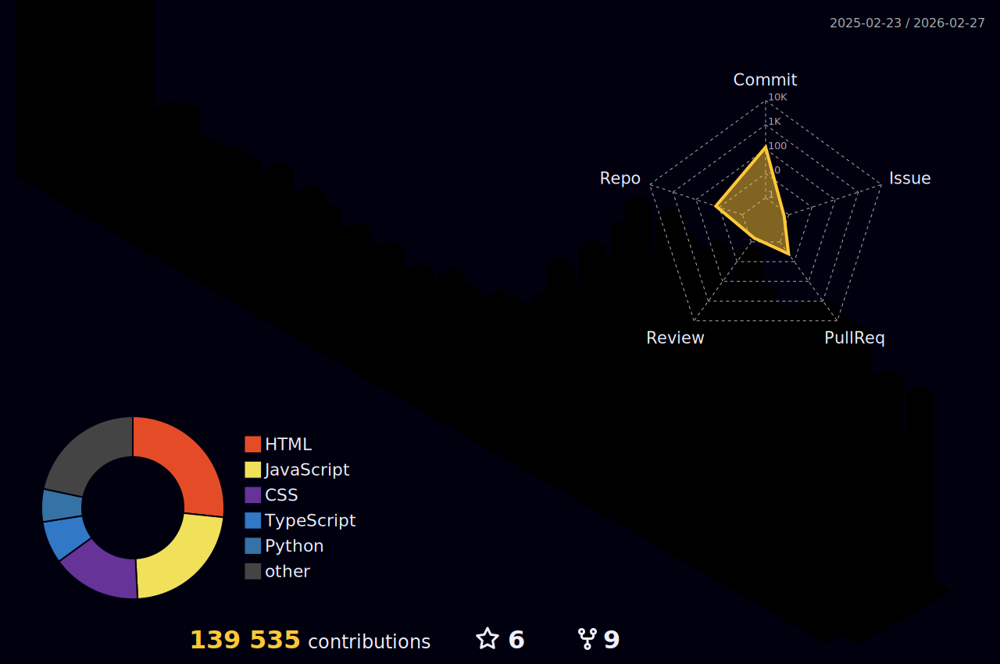

[](https://twitter.com/jpromanonet)
[](https://www.linkedin.com/in/jpromanonet/)
[](https://www.instagram.com/jpromanonet/)
[](https://linktr.ee/jpromanonet)
[](https://wakatime.com/@fc26cab3-6e59-45b5-8005-1a093d31f6b1)

Hey there :wave:

I'm Juan, an analytical, innovative, and motivated software professional with experience in customer service, team leadership, and organizational effectiveness in fast-paced and challenging environments. 
<br/>
<br/>
Adept at developing strategies and driving streamlined operations. Diverse analytical skills, team collaboration, and relationship building. Consummate professional, and motivated leader, with solid interpersonal abilities and complex problem-solving skills. 
<br/>
<br/>
Effective and proven track record of critical thinking, idea generation, and optimizing efficiencies.

Want to know more? <a href="https://jpromano.net">Check out my website</a> or my <a href="http://portfolio.jpromano.net">portfolio here</a>

## 📌 Currently working as

:zap: Engineering Manager at <a href="https://adviters.com">Adviters</a><br/>
:zap: Professor at <a href="https://coderhouse.com">Coderhouse</a><br/>
:zap: Open Source Contributor at <a href="https://slack.ar">Slackware Argentina</a>

## 📝 Latest Blog Posts

<!-- BLOG-POST-LIST:START -->
- [La física detrás de los rayos cósmicos: cómo se forman y cómo afectan a la Tierra](https://divulgadoresporhobby.com/la-fisica-detras-de-los-rayos-cosmicos-como-se-forman-y-como-afectan-a-la-tierra/)
- [Los secretos detrás de los números primos](https://divulgadoresporhobby.com/los-secretos-detras-de-los-numeros-primos/)
- [How to migrate from monolithic architecture to microservices.](https://divulgadoresporhobby.com/how-to-migrate-from-monolithic-architecture-to-microservices/)
- [Semana 04 [2023] | Resumen](https://divulgadoresporhobby.com/semana-04-2023-resumen/)
- [Random Choice Picker [HTML, CSS &amp; JS]](https://divulgadoresporhobby.com/random-choice-picker-html-css-js/)
<!-- BLOG-POST-LIST:END -->

## 💼 Skills


<br>


<br>


<br>


## &#x1f4c8; GitHub Stats



[](https://github.com/jpromanonet/github-readme-stats)

<!--START_SECTION:waka-->

```text
JavaScript   3 hrs 41 mins   ████████████▓░░░░░░░░░░░░   50.32 %
Other        3 hrs           ██████████▒░░░░░░░░░░░░░░   40.94 %
```

<!--END_SECTION:waka-->

<p align="center">
  
<p>

<p align="center">
  
</p>


<div align="center">
  <a href="https://github.com/ryo-ma/github-profile-trophy">
    
  </a>
</div>
<br>
<p align="center">:round_pushpin: Profile visitors</p>
   
  <div align="center">
    <a href="https://github.com/jpromanonet">
    
  </div>

<hr>
 
  <div align="center">
    
  </div>
<hr>

<p align="center">🧉 <b>Fun fact: I'm always drinking <a href="https://en.wikipedia.org/wiki/Mate_(drink)">mate!</a></b> 🧉</p>
