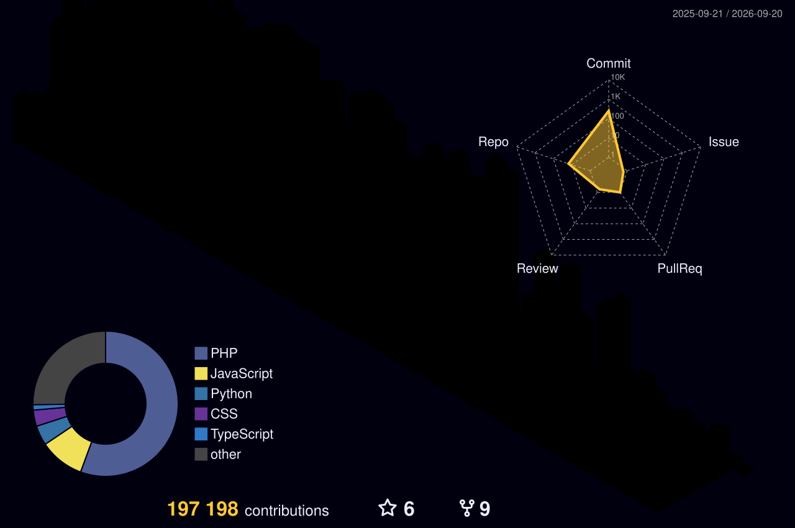

  

# 👋 Hi, I'm Juan

### 💻 I build software, lead teams, write things down, and keep starting overly ambitious projects.

I've spent more than a decade working across code, architecture, infrastructure, products, and people. I enjoy taking difficult systems apart, understanding how they behave, and rebuilding them into something clearer, more reliable, and easier to evolve.

* 🛠️ **I build with:** Java, Python/Django, C++, JavaScript/TypeScript, Node.js, React, Angular, and Vue.
* 🐧 **Beyond application code:** Linux, cloud infrastructure, containers, DevOps, observability, platforms, and open-source software.
* 🧭 **I care about:** technical leadership, sound decisions, honest trade-offs, and helping teams move forward.
* ✍️ **I write about:** technology, engineering leadership, what I learn while building, and fiction about time, identity, and impossible systems.
* 🧉 **Usually nearby:** several active projects, too many books, and a mate.

🌐 [Website](https://jpromano.net) · 🧰 [Portfolio](https://jpromano.net/portfolio/) 

## 📌 Currently working as

:zap: Engineering Manager at <a href="https://hybridbeetechnology.com/">Hybrid Bee Technology</a> 

## 🏆 My github rank in Argentina?
:zap: 

## 💼 Skills

 

 

 

## &#x1f4c8; GitHub Stats

  

🧉 <b>Fun fact: I'm always drinking <a href="https://en.wikipedia.org/wiki/Mate_(drink)">mate!</a></b> 🧉

