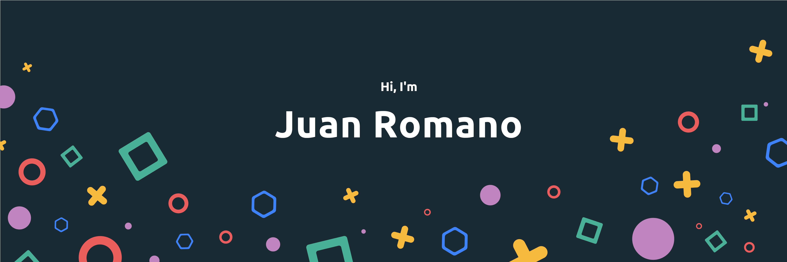

Hey there :wave:

I'm Juan, a senior full-stack engineer, dev-ops engineer and teacher with robust problem-solving skills and more than 9 years of proven experience in creating and designing software solutions for different companies.

Want to know more? <a href="https://jpromano.net">Check out my portfolio</a>

## 📌 Currently working as

:zap: Tech Leader at <a href="https://github.com/thebitar">The Bit</a>

:zap: Mentor at <a href="https://github.com/nucba">Nucba</a>

## 📝 Latest Blog Posts

 

<!-- BLOG-POST-LIST:START -->

<!-- BLOG-POST-LIST:END -->
## 💼 Skills

More Skills

 

 

## &#x1f4c8; GitHub Stats

 

  

 

🧉 <b>Fun fact: I'm always drinking <a href="https://en.wikipedia.org/wiki/Mate_(drink)">mate!</a></b> 🧉
